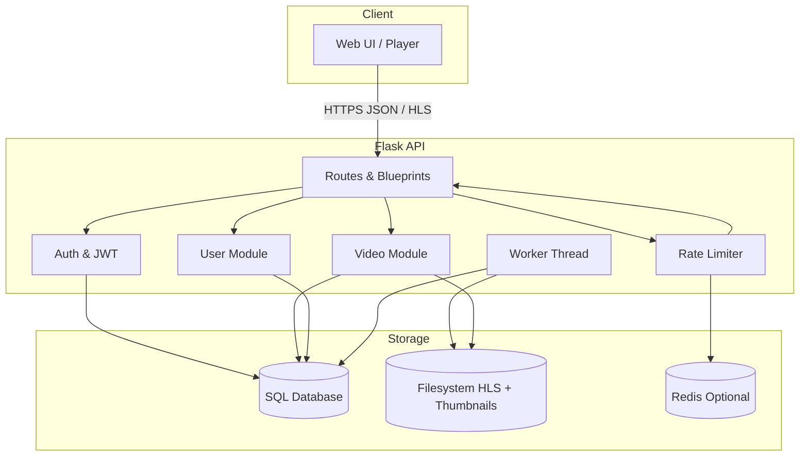

# Documentation Index

- [API Overview](./api/overview.md)
- [Authentication & Authorization](./api/auth.md)
- [User Endpoints](./api/users.md)
- [Video Endpoints](./api/videos.md)
- [Search & Discovery](./api/search.md)
- [Favourites & History](./api/history_favorites.md)
- [Settings](./api/settings.md)
- [HLS Streaming Pipeline](./hls_pipeline.md)
- [Using the Website](./using_the_website.md)
- [Security Model](./security.md)

## Architecture Diagram

