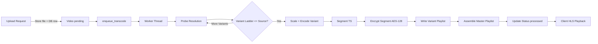

# HLS Streaming Pipeline

The pipeline transforms an uploaded source video into multiple encrypted HLS variants.

## Stages
1. Upload (raw file saved; DB row in `pending` state)
2. Queue (`enqueue_transcode` adds (path, video_uuid) to in‑memory queue)
3. Worker Thread (`start_hls_worker` launches `_worker_loop`)
4. Encoding (`convert_to_hls`) iterates variant ladder ≤ source resolution
5. AES-128 Encryption per segment (OpenSSL CLI, IV = segment index)
6. Variant playlists assembled referencing encrypted segments & keys
7. Master playlist written referencing variant playlists
8. Video status updated to `processed`



## Variant Ladder (Default)
| Name | Resolution | Video Bitrate (kbps) | Audio (kbps) |
|------|------------|----------------------|--------------|
| source | original | 10000 | 160 |
| 4k | 3840x2160 | 12000 | 192 |
| 1440p | 2560x1440 | 8000 | 160 |
| 1080p | 1920x1080 | 5000 | 128 |
| 720p | 1280x720 | 3000 | 96 |
| 480p | 854x480 | 1500 | 96 |
| 360p | 640x360 | 800 | 64 |

Filtered so only resolutions ≤ original are produced.

## Directory Layout
```
app/static/hls_output/<video_uuid>/
  master.m3u8
  1080p/
    segments/enc_segment_000.ts
    keys/key.key
    1080p.m3u8
  720p/
    ...
```

## Encryption
- Each variant has a randomly generated 16-byte key.
- Key URI embedded in playlist: `#EXT-X-KEY:METHOD=AES-128,URI="keys/key.key",IV=0x<iv>`
- Client fetches key (currently JWT-gated) per segment playback.

## Customization
- Modify ladder or bitrates in `tasks.convert_to_hls`.
- Adjust segment length via `segment_time` (default 10s).
- Replace OpenSSL step with FFmpeg `-hls_key_info_file` for integrated encryption.

## Performance Considerations
- For heavy load, move to a distributed queue (Redis, RabbitMQ, Celery workers).
- Offload media to object storage (S3/GCS) and serve via CDN.
- Pre-generate multiple thumbnails or sprite sheets for scrubbing.
